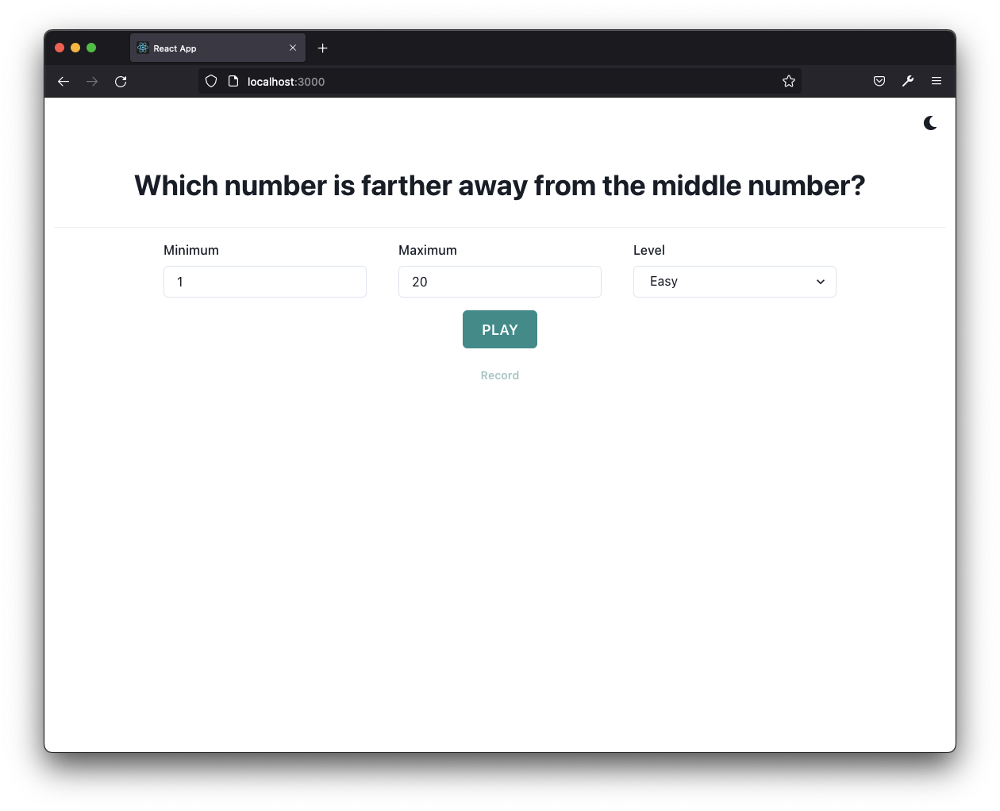
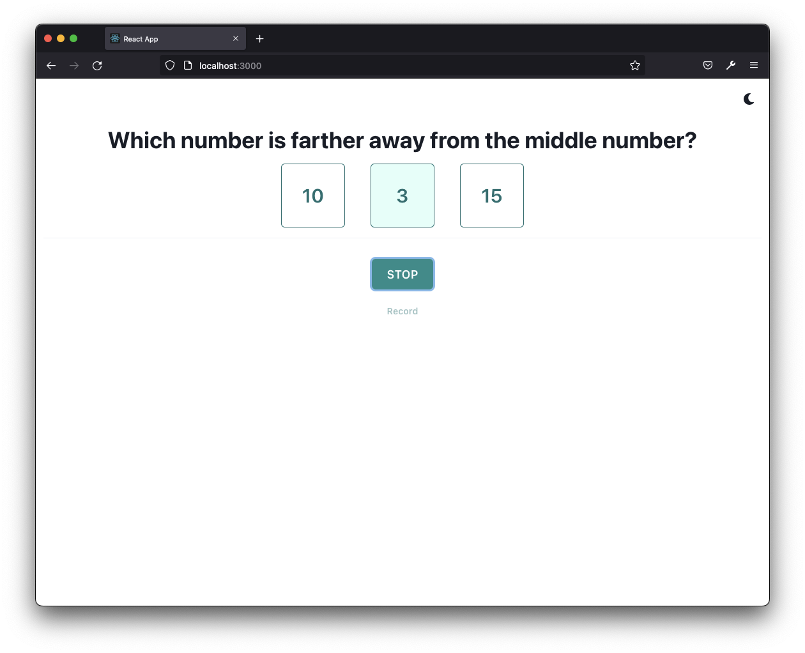

# Number Game

This is a number game built with ReactJS.

## About the Game

[Live Demo](https://jsfiddle.net/dc762gw8/2/)

The rule is simple. three numbers will be present in each round, player needs to pick (mouse click) the number which is
further away from the middle number as quick as possible. The game will stop when player pick the wrong number, a game
record will be displayed.

Here is an example, three numbers `10`, `3`, `15` are given, the process would (more or less) as below.

* Player will work out the `10` is the middle number as `10` is in between `3` and `15`.
* Player will work out `3` is seven away from `10`, and `15` is five away from `10`, hence `3` is the number which is
  farther away from the middle number `10`.
* Player will pick (mouse click) the number `3` as the correct answer.

## How to Play

This game is built with ReactJS, and can be built and deployed as a web app.
For local development or play, can simply run `make play` from the project `root` directory which will spin up a docker
container to host the game, and game can be accessed from `http://localhost:3000` 
